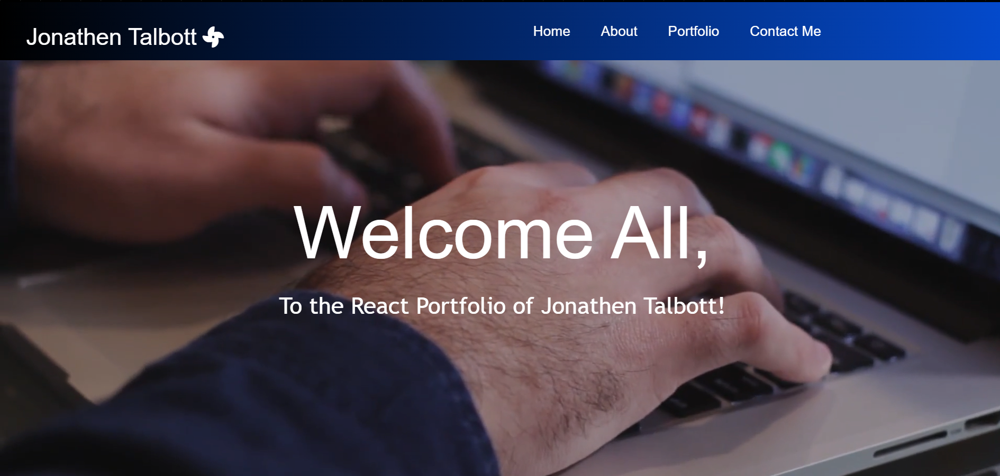

# react-portfolio
## Description
 A React application to showcase my projects and skills.
 
  [Link to Deployed Application](https://jtalbott-react-portfolio.herokuapp.com/)
  
  
  
  ## Table of Contents
  * [Installation](#installation)
  * [Languages and Technologies Used](#languages)
  * [Questions](#questions)
  
  ## Installation
 - assuming node and npm are installed. 

```shell
$ git clone https://github.com/PonderHavok/react-portfolio.git
$ cd react-profile/
$ npm i
```
  ### Screenshots
  
 


  ## Languages and Technologies Used
  * ReactJS
  * HMTL / CSS
  * Javascript
  * Deployed to Heroku web host
  * Node.js and packages:
    * create-react-app
    * bootstrap
    * react-bootstrap
    * react-router-dom
    

  
  ## Questions
  If you have any questions, please send them to me through GitHub or email.

  Github Username: PonderHavok

  [transverseponderer@gmail.com@gmail.com](mailto:transverseponderer@gmail.com)
